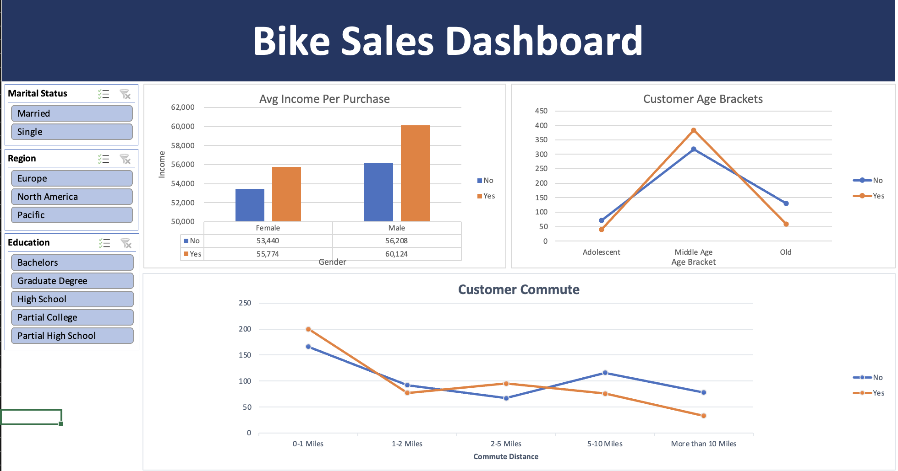

# Bike Sales Dashboard

## Project Overview
Created an interactive Excel dashboard analyzing bike purchase behavior based on:

- Income
- Gender
- Age Brackets
- Customer Commute Distance

## Tools Used
- Microsoft Excel
- Pivot Tables
- Pivot Charts
- Slicers
- Dashboard Design

## Key Insights
- Higher-income customers were more likely to purchase bikes.
- Middle-aged customers showed the highest purchase rates.
- Commute distance influenced bike purchasing behavior.

## Dashboard Preview

